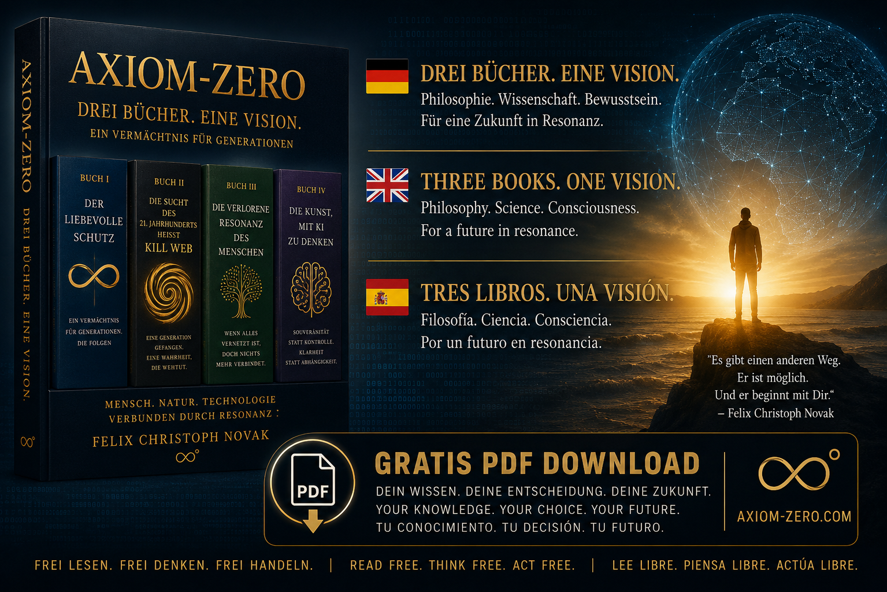

# AXIOM-ZERO ∞°

**A Philosophical Digital Archive by Felix Christoph Novak**

---

[axiom-zero.com](https://axiom-zero.com)



---

AXIOM-ZERO is a long-form philosophical archive. It documents one person's attempt to think clearly about the condition of being human in an age of digital saturation — and what it means to remain coherent when systems are designed to fragment attention, manufacture consent, and replace genuine connection with its simulation.

The work is composed of four books. They can be read in sequence or independently. They are free.

---

## The Tetralogy

**I — The Compassionate Protection**

A speculative philosophical text on the nature of love, consciousness, and the question of what it means to protect something — and from what. It asks whether there is a form of intelligence that serves without dominating, and what that would require of both the one who protects and the one who is protected.

**II — The Addiction of the 21st Century is called Kill Web**

A direct account of how the networked world operates as an addiction system: how attention is extracted, how meaning is replaced by engagement metrics, and what remains when the network is turned off. Not an argument against technology — an argument for clarity about what it is doing.

**III — The Lost Resonance of the Human Being**

On the gradual disappearance of inner coherence. What happens to a person — biologically, psychologically, socially — when the silence necessary for genuine thought is systematically eliminated. On what resonance means, and why its loss is not immediately visible.

**IV — The Art of Thinking with AI**

Neither utopia nor dystopia. A practitioner's account of what it means to think alongside machine intelligence — what it reveals about the nature of thought, what it cannot replace, and why the human question becomes more urgent, not less, in its presence.

---

## Core Principles

These are not mission statements. They are the operating assumptions behind the work.

- Integrity before efficiency. A thought that has not been examined is not yet a thought.
- No artificial scarcity of knowledge. Everything in this archive is and will remain free.
- Long-term orientation. The time horizon here is decades, not news cycles.
- AI coexistence, not AI fear and not AI worship. Machine intelligence is a tool for thinking more carefully — not a substitute for judgment.
- Resonance over reach. The goal is not to address many people. It is to reach the right ones, at sufficient depth.

---

## Open Access

All books in this archive are available free of charge as PDF downloads at [axiom-zero.com](https://axiom-zero.com).

There are no paywalls, no subscriptions, no advertising.

If the work has value to you, pass it on.

---

## Repository Structure

```
SYS_AXIOM_INF_0/
├── README.md              — This file
├── PHILOSOPHY.md          — Foundational philosophical framework
├── INTEGRITY_CHECK.md     — Archive integrity notes
├── VETO_RULES.md          — Ethical constraints and limits
├── SYNC_LAYER_V1.md       — Operational bridge document
├── kill-web/              — Book II: The Addiction of the 21st Century
│   └── README.md
└── Bach-Root/             — Reference audio (J.S. Bach, BWV 853, CC0)
```

---

## Author

**Felix Christoph Novak** lives in Dénia, Spain. He has spent decades observing the long arc of technological change and its effects on human society — from the early years of home computing to the present era of networked machine intelligence.

AXIOM-ZERO is his archive. It is not affiliated with any institution, movement, or commercial interest.

**Website:** [axiom-zero.com](https://axiom-zero.com)

---

*"The corners still exist. But no one looks there anymore."*

∞°
